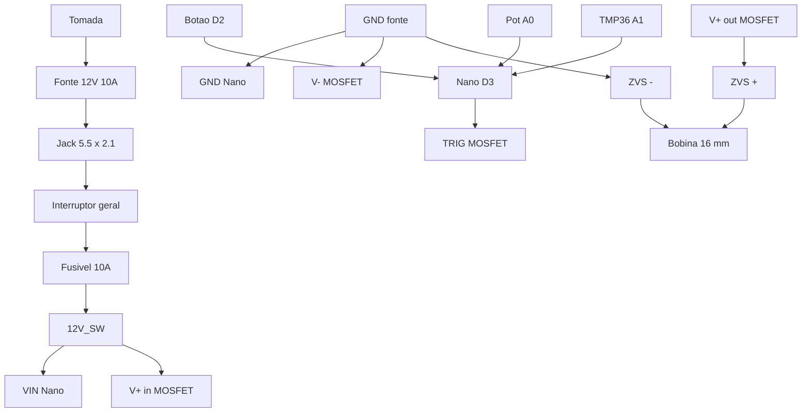

# BOM Brasil e fiação

Lista para a v1 de mesa. Estimativa **R$ 150–280** conforme AliExpress vs loja nacional. Não compre o ZVS 12–48 V / 1800 W.

Depois de soldar: [firmware](firmware/indutor_dynavap.ino) e [afinação](AFINACAO_E_SEGURANCA.md).

---

## Lista de peças

| # | Peça | Spec | Onde | Faixa |
|---|---|---|---|---|
| 1 | Módulo ZVS com bobina | **5–12 V, 120 W** | [Smart Kits MA712](https://www.smartkits.com.br/modulo-aquecedor-indutivo-5v-a-12v) R$ 49,90, [SmartProjects](https://www.smartprojectsbrasil.com.br/mini-modulo-de-aquecimento-por-inducao-zvs-com-bobina), ML/Shopee | R$ 25–80 |
| 2 | MOSFET trigger | 15 A ou **30 A / 400 W**, bornes Vin / Vout / TRIG | AliExpress, ML, kits VapOven | R$ 8–25 |
| 3 | Fonte | **12 V 10 A** (folga 12 A), jack 5,5 × 2,1 mm | ML, fontes de LED/CFTV | R$ 40–80 |
| 4 | Arduino Nano | ATmega328, Mini-USB ou USB-C | ML, lojas de Arduino | R$ 25–50 |
| 5 | Potenciómetro | 10 kΩ linear, eixo 6 mm | qualquer eletrônica | R$ 3–8 |
| 6 | Botão | Momentâneo **SPST** (não use o botão para os 10 A) | — | R$ 2–8 |
| 7 | Interruptor geral | Gangorra **redonda Ø20 mm**, ≥ 6 A no positivo 12 V | Shopee A7 | R$ 3–10 |
| 8 | Fusível | **10 A** vidro 5×20 + **porta painel** (traseira) | Shopee A8 | R$ 5–15 |
| 9 | Jack DC fêmea | **DC-022** 5,5 × 2,1 mm, painel | Shopee A15 | R$ 3–8 |
| 10 | LED câmara | 5 mm + resistor **470 Ω** ¼ W | — | R$ 1 |
| 11 | LED status | 5 mm (pode ser o onboard do Nano) | — | — |
| 12 | Sensor | **TMP36** no dissipador do ZVS (alternativa: NTC 10 kΩ + 10 kΩ) | ML | R$ 5–15 |
| 13 | Tubo de vidro | Ensaio **16×100/150**, vidro comum, **fundo fechado**; cortar ~40–50 mm | Shopee B2 | R$ 3–15 |
| 14 | O-ring | 15 × 3 mm | — | R$ 2 |
| 15 | Cama cerâmica | Roldana isolador **24×24 mm** (chocadeira) **sob** o fundo do tubo — não entra no tubo | Shopee A13 | R$ 10–20 |
| 16 | Fio potência | 16–18 AWG, trechos curtos | — | R$ 5 |
| 17 | Fio sinal | 22 AWG (botão, LED, sensor) | — | — |
| 18 | Caixa | Pack v1 [lisa](caixa-3d/print/v1-lisa/), [relevo](caixa-3d/print/v1/) ou [cavas](caixa-3d/print/v1-cavas/); 92×58×65 + tampa 8 | A14 | R$ 0–40 |
| 19 | Ímã descanso | Disco neodímio **Ø12×3 mm** (preferir diametral) colado no topo esquerdo da tampa | A16 | R$ 3–25 |
| 20 | Opcional | Fio esmaltado **16 AWG** para rebobinar | — | R$ 10–20 |

Kit VapOven mains (~£45) já traz ZVS, MOSFET, botão, jack, vidro, fonte e cavilha — falta Arduino, pot, fusível, TMP36 e caixa. Frete UK costuma anular a vantagem.

---

## O que não comprar

- ZVS 12–48 V / 1000–2500 W (fundição de metal)
- Fonte 12 V **6 A** (cai a tensão e mata o ZVS)
- LiPo de drone
- Botão de painel como único interruptor do ZVS
- Módulo PWM de kHz direto no TRIG sem o firmware lento deste repo

---

## Pinos do Arduino Nano

| Função | Pino | Nota |
|---|---|---|
| Botão momentâneo | **D2** | O outro lado em GND; pull-up interno |
| TRIG do MOSFET | **D3** | HIGH = ZVS ligado. Se o módulo for “active LOW”, inverter `MOSFET_ACTIVE_HIGH` no sketch |
| LED status | **D5** | + resistor 220–470 Ω se for LED externo |
| LED câmara | **D6** | Série com 470 Ω para GND |
| Potenciómetro | **A0** | Cursores: 5 V — A0 — GND |
| TMP36 | **A1** | +Vs → 5 V, Vout → A1, GND → GND. Corpo do sensor no **dissipador** do ZVS, não no cap |

Nano alimentado pelo 5 V regulado: ligue **VIN** no 12 V **depois** do interruptor geral (o regulador do Nano aguenta 12 V) **ou** use um buck 12 V → 5 V em `5V` se o Nano esquentar. GND comum com fonte, MOSFET e ZVS.

---

## Diagrama de blocos



---

## Fiação ASCII (potência vs sinal)

```
FONTE 12V 10A
  + ---- jack ---- interruptor ---- fusivel 10A ----+---- VIN Nano
                                                    |
                                                    +---- V+ in  MOSFET
  - ------------------------------------------------+---- GND Nano
                                                    +---- V- in  MOSFET
                                                    +---- ZVS -
                                                    +---- botão (lado GND)
                                                    +---- TMP36 GND
                                                    +---- pot GND
                                                    +---- LEDs (cátodo via resistor)

MOSFET
  V+ out  ------------------------------------------- ZVS +
  TRIG    ------------------------------------------- Nano D3
  (V- out, se existir, junto com V- in / GND)

ZVS
  bornes da bobina ---- soldar a bobina (não confiar no borne de plástico)
  bobina ---- ao redor do TUBO 16 mm ---- fundo de vidro = stop do cap
  ímã Ø12×3 ---- cavidade na TAMPA (descanso upright, não é trava)

Nano
  D2 ---- botão ---- GND
  D5 ---- LED status ---- 470Ω ---- GND
  D6 ---- LED câmara (olhando o tubo) ---- 470Ω ---- GND
  A0 ---- cursor do pot; extremos 5V e GND
  A1 ---- Vout TMP36; +Vs = 5V
```

O MOSFET comuta o **positivo** entre fonte e ZVS. O botão só mexe em D2. Corrente da bobina **nunca** passa pelo Arduino nem pelo SPST.

Módulos MOSFET 15 A típicos:

| Borne | Liga em |
|---|---|
| Vin+ / V+ in | 12 V depois do fusível |
| Vin− / V− in | GND |
| Vout+ / V+ out | ZVS + |
| Vout− / V− out | ZVS − (ou deixe o ZVS − direto no GND da fonte) |
| TRIG / PWM | Nano D3 (e GND de sinal se o módulo tiver pino SIG−) |

Referência visual VapOven: [MOSFET wiring](https://vapoven.com/mosfet-wiring-diagram/) — o fio do gatilho vai a qualquer pad TRIG/PWM. Aqui o gatilho é o D3, não o botão cru.

---

## Ordem de montagem elétrica

1. Fonte → jack → interruptor → fusível. Multímetro: 12 V estável **sem** ZVS.
2. Ligar só o Nano (VIN/GND), gravar o firmware, confirmar LED e Serial.
3. MOSFET **sem** ZVS: D3 HIGH deve aparecer 12 V em V+ out.
4. Bobina no ar, ZVS nos bornes. Primeiro pulso **curto**. Se a fonte piscar ou a tensão cair abaixo de ~11,5 V, desligar — bobina curta ou fonte fraca.
5. Só então tubo, cama cerâmica, caixa e ímã na tampa. Afinação: [AFINACAO_E_SEGURANCA.md](AFINACAO_E_SEGURANCA.md).

Fios de potência curtos e grossos. Fios longos viram indutância extra e atrapalham o ZVS.
