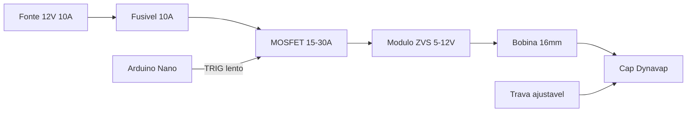

# Indutor DIY para Dynavap

**v1 fechada (set/2026).** Aquecedor de mesa **12 V 10 A** na tomada, caixa 3D pronta para imprimir (relevo AMS ou cavas + cola). Pack de 18650/21700 fica para uma **v2**.

Este kit junta o que Reddit (`r/inductionheaters`), FuckCombustion, VapOven, Thingiverse/Printables e aparelhos comerciais (Wand, YLL 3.0) acertam — e descarta o que queima módulo ou deixa o clique inconsistente.

| Documento | Conteúdo |
|---|---|
| [BOM e fiação](BOM_E_FIACAO.md) | Lista de peças no Brasil, pinos do Nano, diagrama |
| [**Caixa 3D v1**](caixa-3d/README.md) | [Lisa](caixa-3d/print/v1-lisa/), [relevo AMS](caixa-3d/print/v1/) ou [cavas](caixa-3d/print/v1-cavas/) |
| [Lista Mercado Livre](LISTA_COMPRAS_MERCADOLIVRE.md) | Buscas + anúncios + frete CEP 72120-250 |
| [Lista Shopee](LISTA_COMPRAS_SHOPEE.md) | Mesmo modelo de checklist na Shopee |
| [**Lista híbrida**](LISTA_COMPRAS_HIBRIDA.md) | **Melhor custo total — modelo, preço e frete por pedido** |
| [Firmware](firmware/indutor_dynavap.ino) | Botão, timeout 60 s, pulso lento, corte a 60 °C |
| [Afinação e segurança](AFINACAO_E_SEGURANCA.md) | Bobina 16 mm, alvo 60–70 W, checklist |
| [**Maquetes 3D**](maquetes/viewer.html) | Visualizador interativo e [montagem](maquetes/MONTAGEM.md) |

---

## Como funciona

O módulo **ZVS** (oscilador Royer, ~20–100 kHz) alimenta uma bobina. O campo magnético induz correntes de Foucault no cap de aço ou titânio; o metal esquenta de dentro para fora. O clique bimetálico continua sendo o termômetro. Vidro, cerâmica e plástico não aquecem.

O G3 de vidro **não** deve ir em indução (orientação DynaVap).

O que realmente muda o clique:

1. Diâmetro e número de espiras da bobina
2. Profundidade de inserção — o ponto mais quente é o **centro** da bobina
3. Potência efetiva — ~**60–70 W** dá extração uniforme; potência máxima deixa o clique rápido demais e inconsistente entre caps
4. Tempo de exposição — o IH não tem “temperatura”; ele só aquece enquanto estiver ligado

---

## Comparação: comprar vs montar

### Aparelhos prontos

| Modelo | Tipo | Preço aprox. | O que acerta | O que falha |
|---|---|---|---|---|
| **Ispire Wand** | Portátil + dock | USD 115–180 | Adaptador Dynavap, auto/manual, 2×18650 | Auto-shutoff irregular; profundidade mal documentada; caro no BR |
| **YLL 3.0** | Portátil | USD 119–129 | **30–100 W**, profundidade ajustável, vidro trocável, timer 10–60 s, luz, 2×21700 | Baterias muitas vezes à parte; mais peça para copiar do que para reinventar |
| **VapOven** (pronto / kit) | Mesa ou bateria | £45–80 kit | Melhor documentação aberta; fonte de parede **12 V 10 A** | Frete UK; kit de bateria exige células high-drain |
| Orion / Portside Mini | Portátil clássico | nicho / descontinuado | Formato de bolso, clique previsível | Bateria única; variação de bobina entre unidades |
| Sense (Mad Heaters) | Portátil premium | alto | Corta no clique | Preço e estoque |
| Koil Boi / Caldron / VapHotBox / DynaBox | mesa ou USB-C | EUR 80–150 | “Liga e usa” | Menos ajuste que YLL; DIY ganha em custo |

**Comprar** Wand ou YLL 3.0 se a prioridade é usar amanhã. **Montar** este desktop se a prioridade é aprender e gastar ~R$ 150–280.

### Planos grátis e comunidade

| Fonte | O que pegar | O que não copiar |
|---|---|---|
| [VapOven library](https://vapoven.com/build-your-own-dynavap-induction-heater/) | MOSFET no positivo, não cortar o fio da bobina, Arduino com pulso e corte 60 °C | Lista antiga de fonte “12 V qualquer”; o produto deles usa **10 A** |
| [r/inductionheaters](https://www.reddit.com/r/inductionheaters/) + fiação jojo04201 | Arquitetura canônica: ZVS 5–12 V + MOSFET + botão momentâneo | LiPo de drone; comutar 10 A no botão barato |
| [jnico / Thingiverse](https://www.thingiverse.com/thing:4171627) | Caixa 3D, tubo de vidro, cortiça como trava | Fonte 6 A — justa demais |
| [acsdog / Printables](https://www.printables.com/model/1067938-dynavap-induction-heater-box-with-pwm) | Rebobinar 16 AWG no diâmetro do vidro, gabarito de enrolar | PWM de kHz no ZVS |
| [PULSE / Hackster](https://www.hackster.io/wiskey_tango_foxtrot/pulse-induction-heater-dc97ee) | Ciclos on/off de segundos (slowCook) | Tempos fixos no código; melhor um potenciómetro |
| FuckCombustion (física do IH) | Alvo **60–70 W**, banda quente no centro da bobina | Perseguir o clique mais rápido possível |

---

## Conflitos resolvidos

1. **Fonte 6 A vs 10 A.** O ZVS 120 W puxa ~10 A em 12 V. Fonte 6 A cai de tensão; abaixo de 12 V os dois MOSFETs do ZVS conduzem juntos e queimam. **Usar 12 V 10 A (folga: 12 A).**
2. **PWM no ZVS.** PWM de centenas de Hz / kHz impede o oscilador de arrancar. Potência = ligar/desligar o MOSFET em períodos de **100–500 ms**. Não usar `analogWrite` rápido.
3. **Bateria vs tomada.** 3S 18650 funciona, mas é o maior risco. LiPo de drone está fora. BMS de 10 A das listas antigas é apertado. **v1 na tomada.**
4. **Bobina de estoque vs rebobinada.** A bobina do módulo vem com ~23–28 mm de diâmetro interno — frouxa para o cap. Apertar sem cortar (~5 espiras / 16 mm) **ou** rebobinar 16 AWG, 8–10 espiras no tubo.
5. **Potência máxima vs sabor.** Clique < 3 s costuma super-extrair. FC recomenda 60–70 W para clique consistente entre caps.

---

## Arquitetura desta v1 (melhor de cada)

| Origem | O que entrou |
|---|---|
| VapOven | ZVS 5–12 V, MOSFET, botão momentâneo, LED na câmara, tubo 16 mm, O-ring, cavilha |
| YLL 3.0 | Potência ajustável, profundidade mecânica, **timeout 60 s**, vidro trocável, luz |
| FuckCombustion | Calibrar para ~60–70 W |
| Printables | Bobina justa no vidro |
| Thingiverse | Caixa 3D e trava de altura |
| Arduino VapOven | Pulso lento, corte térmico ~60 °C, LED de status |

**Fora da v1:** 18650/21700, BMS, LiPo, PWM de alta frequência, ZVS 12–48 V / 1800 W (é para fundir metal).

Firmware: botão pressionado aquece, soltou para; timeout 60 s se o botão travar; duty pelo potenciómetro; não dispara com dissipador ≥ 60 °C. O clique do cap é o feedback — não há malha IR nesta versão.

Próximo passo: imprimir uma das variantes em [`caixa-3d/print/`](caixa-3d/print/README.md), comprar pela [**lista híbrida**](LISTA_COMPRAS_HIBRIDA.md) (ou [ML](LISTA_COMPRAS_MERCADOLIVRE.md) / [Shopee](LISTA_COMPRAS_SHOPEE.md)), ligar conforme [BOM](BOM_E_FIACAO.md), gravar o [firmware](firmware/indutor_dynavap.ino), depois [afinar a bobina](AFINACAO_E_SEGURANCA.md).
