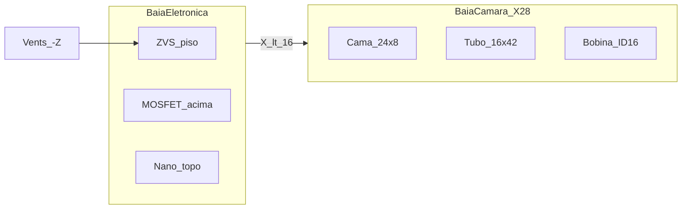

# Layout interno — mesa v1 (maquete 1.1)

**Caixa física congelada:** 92 × 58 × 65 mm + tampa 8 mm. Furos = [`../caixa-3d/box_params.scad`](../caixa-3d/box_params.scad). Esta doc só organiza o **interior**.

Fonte de verdade: [`dimensions.json`](dimensions.json) (precisão **0,1 mm**). Viewer: [`viewer.html`](viewer.html) (fetch do JSON).

Aprendizado do portátil ([`indutor-dynavap-portatil/LAYOUT_COMPACTO.md`](../../indutor-dynavap-portatil/LAYOUT_COMPACTO.md)): `catalog_mm`, clearances, ZVS achatado, cama Ø24×8, bobina ID16, stack Y — **sem** trazer o pack 18650 para esta caixa.

---

## Coordenadas

| Eixo | Sentido |
|---|---|
| Origem | Centro da base externa |
| X | − esquerda · + câmara (tubo em **28**) |
| Y | Altura · + cima |
| Z | + frente (painel) · − traseira (vents) |

Interno: X ∈ [−43,5 … 43,5], Y ∈ [2,5 … 62,5], Z ∈ [−26,5 … 26,5].

---

## Baias

| Zona | X | Conteúdo |
|---|---|---|
| Eletrônica | &lt; 16 | ZVS, MOSFET, Nano, TMP36 |
| Câmara | eixo 28 | Cama, tubo, bobina, O-ring, Dynavap |

O bolsão lateral de ~19 mm do portátil **não cabe** (Z interno = 53 mm). Por isso MOSFET e Nano sobem no eixo Y.

---

## Stack Y — eletrônica

| Face | Y (mm) |
|---|---|
| Piso interno | 2,5 |
| Centro ZVS (H=20) | 12,5 |
| Topo ZVS | 22,5 |
| Base MOSFET (standoff 2) | 24,5 |
| Centro MOSFET | 30,5 |
| Centro Nano (H=11) | 46,0 |
| Topo Nano | 51,5 |
| Face interna tampa | 62,5 |

## Stack Y — câmara (X=28)

| Face | Y (mm) |
|---|---|
| Cama Ø24×8 | 2,5 → 10,5 |
| Tubo Ø16×42 | 10,5 → 52,5 |
| Bobina (4 espiras) | 36 / 42 / 48 / 54 |
| O-ring no collarinho | ~66 |
| Ímã (tampa) | 70 → 73 |

---

## Catálogo (mm)

| Peça | Envelope |
|---|---|
| ZVS | 55 × 37 × 20 |
| XY-MOS | 34 × 17 × 12 |
| Nano | 43,2 × 17,8 × 11 |
| Cama | Ø24 × 8 |
| Tubo | Ø16 × 42 (ID14) |
| Bobina | ID16 / OD22 |
| M7 | Ø10 × 92 + cap Ø10 × 27 |

---

## Clearances mínimos

| Par | Min (mm) |
|---|---|
| ZVS ↔ parede | 3 |
| ZVS ↔ tubo (X) | 2 |
| MOSFET ↔ ZVS (Y) | 2 |
| Nano ↔ tampa | 3 |
| Bobina OD ↔ parede | 2 |

Lista completa em `dimensions.json` → `clearance_checks`.

---

## Fluxo térmico

Inlet traseiro (4 × 10 × 4) → fins do ZVS → sobe sob a tampa. **Não** vedar a tampa. TMP36 na face −Z do dissipador.

Trilha 12 V curta: jack → fusível painel → rocker → MOSFET → ZVS.

---

## O que não fazer

- Mover furos / regenerar STL da caixa enquanto a v1 impressa não for medida
- Duplicar fusível interno (só o porta-fusível de painel)
- Modelar cama como torre 24 mm ou bobina com ID &lt; 16
- Empurrar pack 18650 nesta caixa (repo portátil)
- Encerrar hermético / encostar dissipador no PETG
