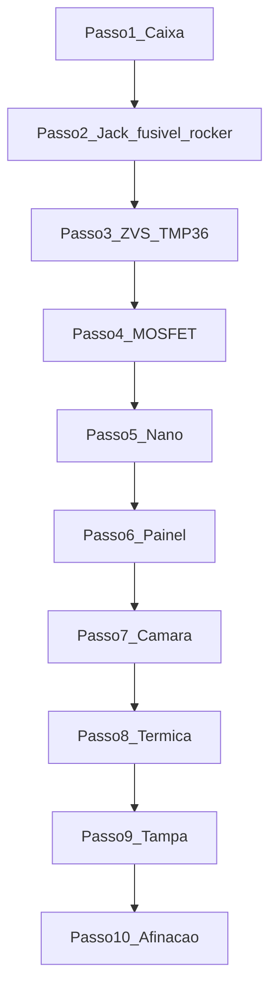

# Montagem — indutor Dynavap v1

Guia passo a passo alinhado ao [visualizador 3D](viewer.html). Cada passo abre no viewer com `viewer.html?step=N`.

Referências: [BOM e fiação](../BOM_E_FIACAO.md) · [Afinação](../AFINACAO_E_SEGURANCA.md) · [Caixa 3D](../caixa-3d/README.md) · [Layout interno](LAYOUT_INTERNO.md)

**Maquete v1.1:** abra o viewer via servidor local (`python -m http.server` em `maquetes/`) para o `fetch` de [`dimensions.json`](dimensions.json).

---

## Antes de começar

- [ ] Imprimir **v1**: [lisa](../caixa-3d/print/v1-lisa/), [relevo AMS](../caixa-3d/print/v1/) **ou** [cavas](../caixa-3d/print/v1-cavas/) (PETG, 0,2 mm, 15–25 % infill) — [guia](../caixa-3d/README.md)
- [ ] Conferir furos do painel (gangorra Ø20,2 · pot Ø7,6 · botão Ø19,2 · LEDs Ø5,2 · jack Ø8,2 · fusível Ø13,2)
- [ ] Fonte **12 V 10 A** (não 6 A; fonte **fora** da caixa)
- [ ] Multímetro, ferro de solda, fio 16 AWG silicone

---

## Passo 1 — Caixa vazia

**Viewer:** [passo 1](viewer.html?step=1)

1. Imprima **uma** variante: lisa (`corpo_liso` + `tampa_lisa`), relevo AMS (`corpo_cor1/2` + `tampa_cor1/2`, Orca Assemble) **ou** cavas (`corpo_cava` + `tampa_cava` + `decais`, cola).
2. Confira furos do painel frontal (CAD `box_params.scad`):
   - **A7** gangorra redonda — furo **Ø20,2 mm**
   - **A5** pot B10K — furo **Ø7,6 mm**
   - **A6** botão 19 mm — furo **Ø19,2 mm**
   - **A9** LEDs — 2× **Ø5,2 mm**
   - Traseira **A15** jack DC-022 — **Ø8,2 mm** + **A8** porta-fusível 5×20 — **Ø13,2 mm**
3. Confira furo superior para tubo Ø ~16 mm (clearance Ø17).
4. **Não** feche hermético — as frestas traseiras são ventilação do ZVS.
5. A **fonte 12 V 10 A fica fora** da caixa; entra só pelo jack.

| Check | OK |
|---|---|
| Corpo sem warping | [ ] |
| Furos alinhados com componentes reais | [ ] |
| Tampa encaixa sem forçar | [ ] |

---

## Passo 2 — Trilha 12 V

**Viewer:** [passo 2](viewer.html?step=2) · Ative **Fiação 12V** no painel lateral.

Ordem no positivo (vermelho, 16 AWG):

```
Fonte + → Jack fêmea → Fusível 10A → Rocker → barra 12V_SW
```

1. Instale o **jack P4** na traseira (solda ou parafuso).
2. **Fusível 10A** + suporte 5×20 no painel traseiro (só o porta-fusível de painel — sem bloco interno duplicado).
3. **Rocker KCD1** no painel frontal — comuta o positivo geral.
4. Negativo (preto): barra comum GND para fonte, MOSFET, ZVS, Nano.

| Check | OK |
|---|---|
| Multímetro: 12 V estável após rocker (ZVS desligado) | [ ] |
| Polaridade do jack conferida | [ ] |
| Fusível 10 A instalado | [ ] |

---

## Passo 3 — ZVS + TMP36

**Viewer:** [passo 3](viewer.html?step=3)

1. Assente o **ZVS** (envelope ~55×37×20) no **piso**, centro aproximado **X=−10**, levemente à traseira — gap ≥3 mm das paredes, ≥2 mm do tubo (X=28).
2. TMP36 com pasta térmica na face do dissipador voltada aos **vents** (−Z).
3. Não encoste o dissipador no PETG.

| Check | OK |
|---|---|
| Gap ZVS↔parede ≥3 mm | [ ] |
| Fins alinhados ao fluxo dos vents | [ ] |
| Serial `Ts=` sobe com o ZVS ligado (passo firmware) | [ ] |

---

## Passo 4 — MOSFET

**Viewer:** [passo 4](viewer.html?step=4)

O **XY-MOS 15 A** comuta o positivo entre a barra 12 V e o ZVS.

| Borne | Liga em |
|---|---|
| V+ in | 12 V depois do fusível / rocker |
| V− in | GND |
| V+ out | ZVS + |
| TRIG | Nano D3 (passo 5) |
| V− out | GND (ou ZVS −) |

1. Monte o MOSFET **acima** do ZVS (standoffs ≥2 mm) — não ao lado no piso (Z interno apertado).
2. Fios de potência **curtos**.

| Check | OK |
|---|---|
| Standoff ≥2 mm sobre o ZVS | [ ] |
| Sem curto mecânico com o Nano | [ ] |

---

## Passo 5 — Arduino Nano

**Viewer:** [passo 5](viewer.html?step=5)

1. Nano **acima** do MOSFET/ZVS (centro ~Y=46), isolado da parede.
2. D3 → TRIG do MOSFET; sensor TMP36; botão / pot / LEDs nos furos do painel.
3. USB: use jumpers ou grave antes de fechar — não há cutout USB na caixa.

| Check | OK |
|---|---|
| Gap Nano↔tampa ≥3 mm | [ ] |
| Não toca dissipador do ZVS | [ ] |

---

## Passo 6 — Painel frontal

**Viewer:** [passo 6](viewer.html?step=6)

Instale botão Ø19,2, pot bushing Ø7,6, LEDs Ø5,2 nos furos **já impressos** (posições congeladas). LED D6 aponta para o tubo.

---

## Passo 7 — Câmara (cama + tubo + bobina)

**Viewer:** [passo 7](viewer.html?step=7)

1. **Cama cerâmica Ø24×8** no piso sob o eixo X=28 (não torre alta).
2. Tubo ensaio Ø16 cortado ~42 mm, fundo fechado, assentado na cama.
3. Bobina **ID ≥16 / OD ~22** em volta do vidro (não apertar a ponto de rachar).
4. O-ring 15×3 no collarinho da tampa.

| Check | OK |
|---|---|
| Fundo do tubo na cama | [ ] |
| Bobina não raspa a parede | [ ] |

---

## Passo 8 — Checagem térmica / ventilação

**Viewer:** [passo 8](viewer.html?step=8)

Vents traseiros livres; tampa **não** hermética. Ver [LAYOUT_INTERNO.md](LAYOUT_INTERNO.md).

---

## Passo 9 — Tampa + ímã

**Viewer:** [passo 9](viewer.html?step=9)

Collarinho Ø22; ímã Ø12×3 colado no pocket **X=−14**. Parafusos M3 nos cantos.

---

## Passo 10 — Pronto

**Viewer:** [passo 10](viewer.html?step=10)

1. Cap no fundo de vidro; M7 ~92 mm; descanso no ímã.
2. Rocker ON → botão → alvo clique **5–8 s** (~60–70 W).
3. Confirme timeout 60 s e corte TMP36 60 °C — [AFINACAO_E_SEGURANCA.md](../AFINACAO_E_SEGURANCA.md).

### Pinos Nano (resumo)

| Pino | Função |
|---|---|
| D2 | Botão → GND (pull-up) |
| D3 | TRIG MOSFET |
| D5 / D6 | LED status / câmara (+ 470 Ω) |
| A0 | Pot 10k |
| A1 | TMP36 Vout |
| VIN / GND | 12 V após rocker / barra comum |

| Check | OK |
|---|---|
| Clique em 5–8 s | [ ] |
| Timeout e corte térmico OK | [ ] |
| Ventilação livre ao fechar | [ ] |

---

## Ordem elétrica resumida



Layout interno: [LAYOUT_INTERNO.md](LAYOUT_INTERNO.md). Pós-montagem: [MELHORIAS.md](MELHORIAS.md).
