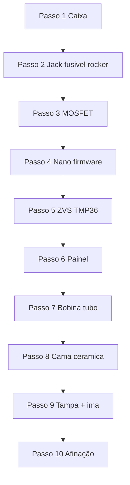

# Montagem — indutor Dynavap v1

Guia passo a passo alinhado ao [visualizador 3D](viewer.html). Cada passo abre no viewer com `viewer.html?step=N`.

Referências: [BOM e fiação](../BOM_E_FIACAO.md) · [Afinação](../AFINACAO_E_SEGURANCA.md) · [Caixa 3D](../caixa-3d/README.md)

---

## Antes de começar

- [ ] Imprimir **v1**: [lisa](../caixa-3d/print/v1-lisa/), [relevo AMS](../caixa-3d/print/v1/) **ou** [cavas](../caixa-3d/print/v1-cavas/) (PETG, 0,2 mm, 15–25 % infill) — [guia](../caixa-3d/README.md)
- [ ] Conferir furos do painel (gangorra Ø20,2 · pot Ø7,6 · botão Ø19,2 · LEDs Ø5,2 · jack Ø8,2 · fusível Ø13,2)
- [ ] Fonte **12 V 10 A** (não 6 A; fonte **fora** da caixa)
- [ ] Multímetro, ferro de solda, fio 16 AWG silicone

---

## Passo 1 — Caixa vazia

**Viewer:** [passo 1](viewer.html?step=1)

1. Imprima **uma** variante: lisa (`corpo_liso` + `tampa_lisa`), relevo AMS (`corpo_cor1/2` + `tampa_cor1/2`, Orca Assemble) **ou** cavas (`corpo_cava` + `tampa_cava` + `decais`, cola).
2. Confira furos do painel frontal (CAD `box_params.scad`):
   - **A7** gangorra redonda — furo **Ø20,2 mm**
   - **A5** pot B10K — furo **Ø7,6 mm**
   - **A6** botão 19 mm — furo **Ø19,2 mm**
   - **A9** LEDs — 2× **Ø5,2 mm**
   - Traseira **A15** jack DC-022 — **Ø8,2 mm** + **A8** porta-fusível 5×20 — **Ø13,2 mm**
3. Confira furo superior para tubo Ø ~16 mm (clearance Ø17).
4. **Não** feche hermético — as frestas traseiras são ventilação do ZVS.
5. A **fonte 12 V 10 A fica fora** da caixa; entra só pelo jack.

| Check | OK |
|---|---|
| Corpo sem warping | [ ] |
| Furos alinhados com componentes reais | [ ] |
| Tampa encaixa sem forçar | [ ] |

---

## Passo 2 — Trilha 12 V

**Viewer:** [passo 2](viewer.html?step=2) · Ative **Fiação 12V** no painel lateral.

Ordem no positivo (vermelho, 16 AWG):

```
Fonte + → Jack fêmea → Rocker → Fusível 10A → barra 12V_SW
```

1. Instale o **jack P4** na traseira (solda ou parafuso).
2. **Rocker KCD1** no painel — comuta o positivo geral.
3. **Fusível 10A** + suporte 5×20 logo após o rocker, o mais perto possível da entrada.
4. Negativo (preto): barra comum GND para fonte, MOSFET, ZVS, Nano.

| Check | OK |
|---|---|
| Multímetro: 12 V estável após rocker (ZVS desligado) | [ ] |
| Polaridade do jack conferida | [ ] |
| Fusível 10 A instalado | [ ] |

---

## Passo 3 — MOSFET

**Viewer:** [passo 3](viewer.html?step=3)

O **XY-MOS 15 A** comuta o positivo entre a barra 12 V e o ZVS.

| Borne | Liga em |
|---|---|
| V+ in | 12 V depois do fusível |
| V− in | GND |
| V+ out | ZVS + |
| TRIG | Nano D3 (passo 4) |
| V− out | GND (ou ZVS − direto na fonte) |

1. Parafuse o MOSFET na base da caixa (ou use fita kapton provisória).
2. Fios de potência **curtos** — loop fonte → fusível → MOSFET → ZVS.

| Check | OK |
|---|---|
| Sem ZVS: D3 HIGH → 12 V em V+ out (teste no passo 4) | [ ] |
| Nenhum fio de potência passa pelo Arduino | [ ] |

---

## Passo 4 — Arduino Nano

**Viewer:** [passo 4](viewer.html?step=4) · Ative **Fiação sinal**.

1. **VIN** → 12 V depois do rocker · **GND** → barra comum.
2. Grave o [firmware](../firmware/indutor_dynavap.ino) e confirme LED onboard / Serial.
3. Ligue **D3** ao TRIG do MOSFET.
4. Reserve jumpers para D2 (botão), A0 (pot), A1 (TMP36), D5/D6 (LEDs).

| Pino | Função |
|---|---|
| D2 | Botão → GND (pull-up interno) |
| D3 | TRIG MOSFET |
| D5 | LED status + 470 Ω → GND |
| D6 | LED câmara + 470 Ω → GND |
| A0 | Pot 10k (5V — A0 — GND) |
| A1 | TMP36 Vout (passo 5) |

| Check | OK |
|---|---|
| Firmware gravado, Serial OK | [ ] |
| D3 HIGH liga saída do MOSFET | [ ] |

---

## Passo 5 — ZVS + TMP36

**Viewer:** [passo 5](viewer.html?step=5) · Use **Corte lateral** para ver o sensor.

1. ZVS **−** no GND · ZVS **+** no V+ out do MOSFET.
2. **Não** ligue a bobina ainda — primeiro teste sem carga.
3. **TMP36** colado no dissipador do ZVS (pasta térmica ou abraçadeira de nylon + thermal pad).
   - +Vs → 5 V Nano · Vout → A1 · GND → GND
4. Primeiro pulso **curto** com botão (ainda sem bobina montada na caixa).

| Check | OK |
|---|---|
| Fonte não pisca; tensão ≥ 11,5 V | [ ] |
| TMP36 lê temperatura plausível na Serial | [ ] |
| Dissipadores com espaço para ar | [ ] |

---

## Passo 6 — Painel

**Viewer:** [passo 6](viewer.html?step=6)

1. **Pot B10K** — eixo 6 mm no furo; extremos em 5 V e GND; cursor em A0.
2. **Botão 19 mm** — só os contatos SPST (ignore LED interno 12/24 V ou alimente separado).
3. **LED status (D5)** — verde, 470 Ω para GND.
4. **LED câmara (D6)** — amarelo/branco, apontando para o tubo, 470 Ω para GND.

| Check | OK |
|---|---|
| Botão momentâneo (não trava) | [ ] |
| Pot gira suave, sem folga no furo | [ ] |
| LEDs acendem no sketch de teste | [ ] |

---

## Passo 7 — Bobina + tubo

**Viewer:** [passo 7](viewer.html?step=7)

### Método A — Apertar bobina original

1. Tubo de vidro Ø ~16 mm como mandril.
2. Fechar para ~5 espiras justas — **não corte** o fio.
3. Soldar bobina na placa ZVS (bornes de plástico derretem).

### Método B — Rebobinar 16 AWG

1. 8–10 espiras no tubo ou no [coil chuck](https://www.printables.com/model/1067938-dynavap-induction-heater-box-with-pwm) do acsdog.
2. Soldar na placa.

3. Tubo dentro da bobina · **O-ring 15×3** no assento da caixa.

| Check | OK |
|---|---|
| Bobina soldada, isolamento intacto | [ ] |
| Tubo firme com O-ring | [ ] |
| Corrente ociosa baixa (bobina no ar, pulso curto) | [ ] |

---

## Passo 8 — Cama cerâmica 24×24

**Viewer:** [passo 8](viewer.html?step=8)

1. Roldana isolador **24×24 mm** sob o **fundo fechado** do tubo (não entra no tubo).
2. Isola o PETG do vidro quente. O cap para no **vidro**, não na cerâmica.
3. Profundidade do cap = comprimento cortado do tubo (~42 mm) + posição da bobina.

| Objetivo | Ajuste |
|---|---|
| Clique < 3 s | Subir bobina / menos cap no centro / baixar pot |
| Clique > 12 s | Mais cap na bobina / apertar espiras / subir pot |
| Marca | Fita no stem na posição boa |

---

## Passo 9 — Tampa + ímã

**Viewer:** [passo 9](viewer.html?step=9)

1. Passe o conjunto tubo + bobina pelo furo superior (collarinho Ø22).
2. Fixe tampa com parafusos **M3** (4 cantos, furos 3,4 mm) — STL em [`caixa-3d/stl/`](../caixa-3d/stl/).
3. Cole o ímã **Ø12×3** na cavidade do **topo esquerdo** (Super Bonder / epóxi). Preferir diametral.
4. Confirme ventilação traseira livre — ZVS não pode ficar em caixa fechada.

| Check | OK |
|---|---|
| Tampa sem folga excessiva | [ ] |
| Ar circula nos dissipadores | [ ] |
| Nada pinça fios ao fechar | [ ] |

---

## Passo 10 — Pronto para uso

**Viewer:** [passo 10](viewer.html?step=10) · Modo **Montado** + Dynavap M7.

1. Insira o **Dynavap M7** (cap metálico) no tubo até o fundo de vidro.
2. Rocker ON → segure botão → conte até o clique (alvo 5–8 s).
3. Entre sessões, apoie o M7 no **ímã da tampa** (cap no ímã, upright).
4. Ajuste pot/bobina conforme [AFINACAO_E_SEGURANCA.md](../AFINACAO_E_SEGURANCA.md).
5. Teste timeout 60 s e corte térmico 60 °C.

| Check | OK |
|---|---|
| Clique em 5–8 s | [ ] |
| Potência ~60–70 W (5–6 A) | [ ] |
| Timeout e corte térmico OK | [ ] |
| Cap sai quente — cuidado ao retirar | [ ] |

---

## Ordem elétrica resumida



---

## Melhorias de layout

Depois de percorrer os 10 passos no viewer, veja [MELHORIAS.md](MELHORIAS.md) para ajustes na caixa antes da impressão final.
